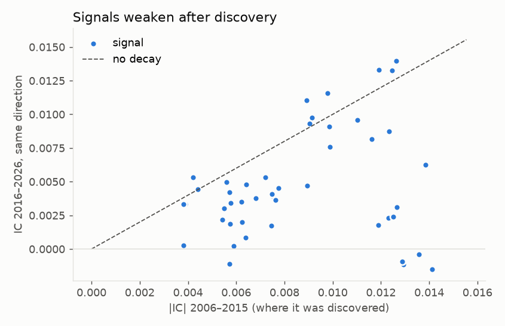
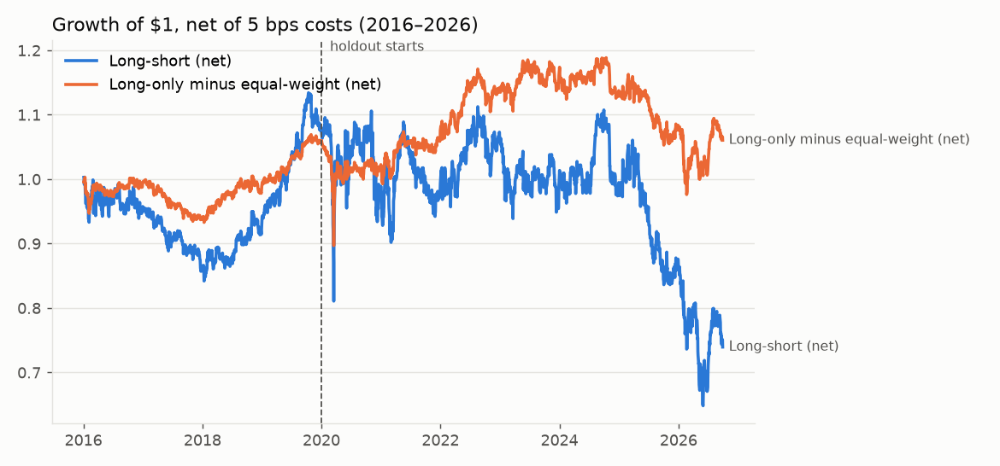

# Signal Factory: Results

_Generated by `scripts/run_pipeline.py --stage final`. Data snapshot: `prices.parquet` sha256 `dc5c7c1123cb696d…`, 2006-01-03 to 2026-09-29._

## Setup

- **Universe:** point-in-time S&P 500 members, 2,442,466 stock-days, ~468 stocks per day.
- **Timing:** signal from the close of day t, buy/sell at the open of t+1, close out at the open of t+2.
- **Costs:** 5 bps per unit of turnover (one-way), sensitivity below.
- **Signals tested:** 227 formulaic ideas across 7 families.
- **Walk-forward:** each year's models see only data before that year (minus a 5-day gap). 2016–2019 was used to choose the configuration; **2020–2026 is the untouched holdout**.
- **Chosen configuration (frozen before the holdout was run):** `h5_simple|hl10|band20` — picked from 36 configurations by long-short net Sharpe at 5 bps.

## Research log (in the order it happened)

1. **Round 1** — 18 configurations, models trained on the next-day return. Validation 2016–2019: **all 18 of 18 lost money after costs** (best net Sharpe -0.17). The edge was real before costs (best gross Sharpe 0.81) but needed ~2.3x turnover a day. (`reports/validation_round1.csv`)
2. **Round 2** — added 18 configurations trained on the 5-day return so positions can be held longer. Decided on validation data only; the holdout had not been run. Best validation net Sharpe across all 36: 0.24 → frozen. (`reports/validation_scores.csv`)
3. **Final** — the holdout was run once, with the frozen choice. All 36 configurations count as trials in the deflated Sharpe ratio.

## 1. Signal discovery (2006–2015)

Hurdle: Newey-West |t| > 3 on the daily rank-IC.

| | Real target | Shuffled target (pure luck) |
|---|---|---|
| Signals with \|t\| > 3 | **46** of 227 | 1 |
| Signals with \|t\| > 2 (the usual, too-easy bar) | 108 | 11 |

Of the 46 discoveries, **41** kept the same direction in 2016–2026, and on average they kept **56%** (median) of their strength.

### Strongest discoveries

| Signal | Family | IC 06–15 | t 06–15 | IC 16–26 (same dir.) | t 16–26 | L/S Sharpe 06–15 | L/S Sharpe 16–26 net | Turnover/day |
|---|---|---|---|---|---|---|---|---|
| `wq_016` | worldquant | +0.0075 | +6.5 | +0.0017 | +1.4 | 1.03 | -1.94 | 1.67 |
| `x_ret_1__vol_21` | interaction | -0.0089 | -6.0 | +0.0047 | +2.8 | 0.99 | -1.67 | 3.11 |
| `wq_044` | worldquant | +0.0068 | +5.3 | +0.0038 | +2.8 | 0.51 | -2.44 | 2.23 |
| `wq_013` | worldquant | +0.0062 | +5.2 | +0.0020 | +1.7 | 0.47 | -1.77 | 1.61 |
| `wq_015` | worldquant | +0.0064 | +5.2 | +0.0008 | +0.7 | 1.02 | -3.11 | 2.07 |
| `x_ret_1__idiovol_21` | interaction | -0.0075 | -5.1 | +0.0039 | +2.4 | 0.87 | -1.60 | 3.09 |
| `x_intraday_1__dv_shock_5` | interaction | -0.0062 | -5.1 | +0.0035 | +2.8 | 0.89 | -3.96 | 3.40 |
| `wq_055` | worldquant | +0.0057 | +4.9 | +0.0019 | +1.7 | 0.77 | -2.89 | 1.89 |
| `dist_low_5` | technical | -0.0139 | -4.6 | +0.0063 | +1.9 | 0.44 | -1.17 | 2.08 |
| `wq_002` | worldquant | +0.0055 | +4.6 | +0.0030 | +2.6 | 0.59 | -2.64 | 1.71 |
| `x_ret_252_skip21__vol_63` | interaction | +0.0077 | +4.6 | +0.0045 | +2.7 | 0.16 | -0.13 | 0.29 |
| `dist_low_10` | technical | -0.0123 | -4.3 | +0.0087 | +2.7 | 0.40 | -0.80 | 1.60 |
| `x_ret_5__log_dollar_vol_21` | interaction | -0.0054 | -4.3 | +0.0022 | +1.8 | 0.92 | -1.16 | 1.40 |
| `streak` | technical | -0.0099 | -4.2 | +0.0091 | +3.2 | 0.94 | -1.12 | 2.30 |
| `absr_dv_corr_21` | liquidity | -0.0059 | -4.2 | +0.0002 | +0.1 | 0.33 | -1.24 | 0.77 |
| `maxret_5` | risk | -0.0127 | -4.2 | +0.0031 | +1.0 | 0.44 | -0.66 | 1.31 |
| `x_ret_1__beta_252` | interaction | -0.0064 | -4.1 | +0.0048 | +2.8 | 0.73 | -2.17 | 3.12 |
| `wq_026` | worldquant | +0.0056 | +3.9 | +0.0050 | +3.0 | 0.19 | -1.07 | 1.44 |
| `days_since_high_252` | technical | -0.0116 | -3.8 | +0.0082 | +2.2 | 0.01 | -0.54 | 0.63 |
| `parkinson_1` | risk | -0.0141 | -3.8 | -0.0015 | -0.4 | 0.15 | -1.85 | 2.64 |

_Full lists: `reports/signals_discovery.csv`, `reports/signals_all.csv`._

### By family

| Family | Tested | Passed |
|---|---|---|
| interaction | 25 | 12 |
| worldquant | 26 | 10 |
| risk | 39 | 9 |
| technical | 61 | 8 |
| momentum | 40 | 5 |
| liquidity | 31 | 2 |
| seasonal | 5 | 0 |

### Walk-forward selection per year

| Test year | Passed hurdle | Kept after de-duplication | Strongest kept |
|---|---|---|---|
| 2016 | 26 | 20 | x_ret_1__log_dollar_vol_21, wq_055, x_ret_5__log_dollar_vol_21, x_intraday_1__dv_shock_5, wq_042 |
| 2017 | 27 | 21 | x_ret_1__log_dollar_vol_21, x_ret_5__log_dollar_vol_21, x_intraday_1__dv_shock_5, wq_042, wq_055 |
| 2018 | 25 | 19 | x_ret_1__log_dollar_vol_21, x_intraday_1__dv_shock_5, x_ret_5__log_dollar_vol_21, wq_055, wq_042 |
| 2019 | 27 | 20 | x_ret_1__log_dollar_vol_21, x_intraday_1__dv_shock_5, wq_055, x_ret_5__log_dollar_vol_21, wq_002 |
| 2020 | 28 | 22 | x_ret_1__log_dollar_vol_21, x_intraday_1__dv_shock_5, x_ret_5__log_dollar_vol_21, wq_055, wq_002 |
| 2021 | 35 | 27 | x_ret_1__log_dollar_vol_21, x_intraday_1__dv_shock_5, x_ret_5__log_dollar_vol_21, x_resret_1__dv_shock_21, x_ret_1__vol_21 |
| 2022 | 36 | 25 | x_ret_1__log_dollar_vol_21, x_intraday_1__dv_shock_5, x_ret_5__log_dollar_vol_21, wq_002, wq_016 |
| 2023 | 42 | 27 | x_intraday_1__dv_shock_5, x_ret_1__log_dollar_vol_21, wq_002, x_resret_1__dv_shock_21, wq_041 |
| 2024 | 36 | 26 | x_intraday_1__dv_shock_5, x_ret_1__log_dollar_vol_21, x_resret_1__dv_shock_21, wq_034, wq_002 |
| 2025 | 41 | 26 | x_intraday_1__dv_shock_5, x_ret_1__log_dollar_vol_21, x_resret_1__dv_shock_21, wq_034, ret_1 |
| 2026 | 40 | 27 | x_intraday_1__dv_shock_5, x_resret_1__dv_shock_21, x_ret_1__log_dollar_vol_21, wq_034, wq_002 |

## 2. Combined strategy

| Strategy | Ann. return | Ann. vol | Sharpe | Max drawdown | Turnover/day |
|---|---|---|---|---|---|
| **Validation 2016–2019** | | | | | |
| Long-short, net | 2.2% | 9.3% | 0.24 | -16.0% | 0.29 |
| Long-short, gross | 5.9% | 9.3% | 0.63 | -11.1% | n/a |
| Long-only top decile, net | 14.9% | 14.1% | 1.06 | -21.0% | 0.15 |
| Long-only minus equal-weight, net | 1.5% | 4.5% | 0.34 | -7.0% | n/a |
| Equal-weight S&P 500 members | 13.4% | 12.6% | 1.06 | -19.5% | n/a |
| SPY (same open-to-open timing) | 14.4% | 12.5% | 1.16 | -19.0% | n/a |
| **Holdout 2020–2026** | | | | | |
| Long-short, net | -3.8% | 18.7% | -0.20 | -41.7% | 0.27 |
| Long-short, gross | -0.5% | 18.7% | -0.02 | -38.0% | n/a |
| Long-only top decile, net | 13.8% | 21.9% | 0.63 | -46.1% | 0.14 |
| Long-only minus equal-weight, net | 0.3% | 7.8% | 0.04 | -17.9% | n/a |
| Equal-weight S&P 500 members | 13.5% | 19.9% | 0.68 | -37.8% | n/a |
| SPY (same open-to-open timing) | 16.2% | 19.1% | 0.84 | -32.0% | n/a |

**Deflated Sharpe ratio (holdout, 36 trials): 0.00** — the probability that the holdout Sharpe is real skill rather than the luck of picking the best of many tries. Above 0.95 is convincing.

### Cost sensitivity (holdout)

| Cost (bps) | Long-short ann. | Long-short Sharpe | Long-only excess ann. | Long-only excess Sharpe |
|---|---|---|---|---|
| 0 | -0.5% | -0.02 | 2.1% | 0.27 |
| 2 | -1.8% | -0.10 | 1.4% | 0.18 |
| 5 | -3.8% | -0.20 | 0.3% | 0.04 |
| 10 | -7.2% | -0.39 | -1.4% | -0.18 |
| 20 | -13.9% | -0.75 | -4.9% | -0.63 |

### Year by year (sum of daily returns, net)

| Year | Long-short | Long-only | Equal-weight | SPY |
|---|---|---|---|---|
| 2016 | -3.7% | 16.6% | 16.9% | 14.2% |
| 2017 | -10.8% | 11.8% | 17.5% | 19.7% |
| 2018 | 8.6% | -2.7% | -7.9% | -4.6% |
| 2019 | 14.8% | 34.0% | 27.0% | 28.3% |
| 2020 | -4.3% | 16.3% | 19.2% | 19.9% |
| 2021 | 1.6% | 34.9% | 29.6% | 28.5% |
| 2022 | 8.0% | -2.4% | -8.4% | -17.9% |
| 2023 | -6.1% | 16.1% | 14.1% | 22.9% |
| 2024 | 0.6% | 11.4% | 13.6% | 24.3% |
| 2025 | -11.6% | 9.3% | 14.0% | 18.8% |
| 2026 | -13.9% | 7.4% | 8.7% | 12.1% |

### Prediction quality by model (mean daily rank-IC)

| Year | simple | lgbm_selected | lgbm_all | h5_simple | h5_lgbm_selected | h5_lgbm_all |
|---|---|---|---|---|---|---|
| 2016 | +0.0100 | +0.0085 | +0.0150 | +0.0135 | +0.0073 | +0.0185 |
| 2017 | +0.0069 | +0.0120 | +0.0233 | +0.0038 | +0.0060 | +0.0206 |
| 2018 | +0.0145 | +0.0183 | +0.0150 | +0.0151 | +0.0091 | +0.0077 |
| 2019 | +0.0049 | +0.0012 | -0.0014 | +0.0108 | +0.0026 | +0.0099 |
| 2020 | +0.0359 | +0.0384 | +0.0418 | +0.0275 | +0.0184 | +0.0316 |
| 2021 | +0.0088 | +0.0067 | +0.0102 | +0.0093 | +0.0043 | +0.0089 |
| 2022 | +0.0134 | +0.0123 | +0.0258 | +0.0054 | +0.0057 | +0.0107 |
| 2023 | +0.0074 | +0.0070 | +0.0061 | +0.0104 | +0.0064 | +0.0094 |
| 2024 | +0.0136 | +0.0100 | +0.0142 | +0.0064 | +0.0066 | +0.0138 |
| 2025 | +0.0026 | -0.0019 | +0.0104 | +0.0003 | -0.0034 | +0.0238 |
| 2026 | +0.0209 | +0.0247 | +0.0227 | +0.0177 | +0.0165 | +0.0167 |

### Every configuration (chosen on validation; holdout shown for transparency)

| Config | Validation Sharpe | Holdout Sharpe | Holdout ann. | Holdout turnover |
|---|---|---|---|---|
| `h5_simple|hl10|band20` **(chosen)** | 0.24 | -0.20 | -3.8% | 0.27 |
| `h5_lgbm_selected|hl10|band20` | 0.18 | -0.12 | -1.7% | 0.16 |
| `h5_lgbm_selected|hl10|noband` | 0.08 | -0.03 | -0.5% | 0.33 |
| `h5_simple|hl10|noband` | 0.02 | -0.16 | -3.4% | 0.45 |
| `h5_lgbm_all|hl3|band20` | -0.08 | 0.68 | 10.9% | 0.31 |
| `h5_simple|hl3|band20` | -0.11 | -0.15 | -3.0% | 0.55 |
| `h5_lgbm_all|hl10|band20` | -0.16 | 0.81 | 11.2% | 0.15 |
| `simple|hl10|band20` | -0.17 | -0.24 | -5.0% | 0.20 |
| `h5_lgbm_selected|hl3|band20` | -0.18 | -0.01 | -0.1% | 0.46 |
| `simple|hl10|noband` | -0.18 | -0.27 | -6.4% | 0.34 |
| `h5_lgbm_all|hl3|noband` | -0.20 | 0.61 | 11.8% | 0.51 |
| `h5_lgbm_all|hl10|noband` | -0.25 | 0.81 | 13.7% | 0.24 |
| `h5_simple|hl3|noband` | -0.25 | -0.13 | -2.9% | 0.90 |
| `simple|hl3|band20` | -0.29 | -0.25 | -5.2% | 0.45 |
| `h5_lgbm_selected|hl3|noband` | -0.32 | -0.08 | -1.3% | 0.79 |
| `lgbm_selected|hl10|band20` | -0.34 | -0.04 | -1.0% | 0.14 |
| `lgbm_all|hl10|band20` | -0.35 | 0.18 | 3.5% | 0.15 |
| `lgbm_selected|hl10|noband` | -0.38 | -0.13 | -3.3% | 0.33 |
| `h5_lgbm_all|hl0|band20` | -0.41 | 0.42 | 7.4% | 1.20 |
| `lgbm_all|hl10|noband` | -0.43 | 0.25 | 5.6% | 0.31 |
| `simple|hl3|noband` | -0.43 | -0.11 | -2.6% | 0.71 |
| `lgbm_selected|hl3|band20` | -0.51 | -0.05 | -1.1% | 0.43 |
| `lgbm_all|hl3|band20` | -0.53 | 0.38 | 6.9% | 0.40 |
| `lgbm_selected|hl3|noband` | -0.57 | -0.08 | -1.9% | 0.79 |
| `lgbm_all|hl3|noband` | -0.69 | 0.40 | 8.1% | 0.72 |
| `h5_lgbm_all|hl0|noband` | -0.82 | 0.15 | 3.0% | 1.82 |
| `simple|hl0|band20` | -1.27 | -0.29 | -5.9% | 1.52 |
| `simple|hl0|noband` | -1.45 | -0.45 | -10.0% | 2.25 |
| `h5_simple|hl0|band20` | -1.45 | -0.48 | -9.4% | 1.93 |
| `lgbm_all|hl0|band20` | -1.62 | 0.15 | 2.5% | 1.84 |
| `h5_simple|hl0|noband` | -1.93 | -0.72 | -15.4% | 2.64 |
| `lgbm_all|hl0|noband` | -2.18 | -0.11 | -1.9% | 2.45 |
| `lgbm_selected|hl0|band20` | -2.32 | -0.68 | -12.2% | 2.01 |
| `h5_lgbm_selected|hl0|band20` | -2.59 | -0.95 | -12.5% | 2.08 |
| `lgbm_selected|hl0|noband` | -2.87 | -0.97 | -18.2% | 2.61 |
| `h5_lgbm_selected|hl0|noband` | -3.04 | -1.26 | -17.5% | 2.67 |

## Caveats

- **Survivorship:** the free data is missing prices for some companies that left the index (about 25% of members in 2006, under 3% after 2020). Long-short ranking is less affected than long-only returns, but results before ~2012 are flattered.
- Stocks whose next two opens are missing (mostly takeovers) are left out of that day's portfolio — a small, unavoidable look-ahead.
- Costs are a flat per-trade charge; no market impact model, no borrow fees for shorts.
- Returns are summed daily returns of a $1 book, ignoring financing and margin.
